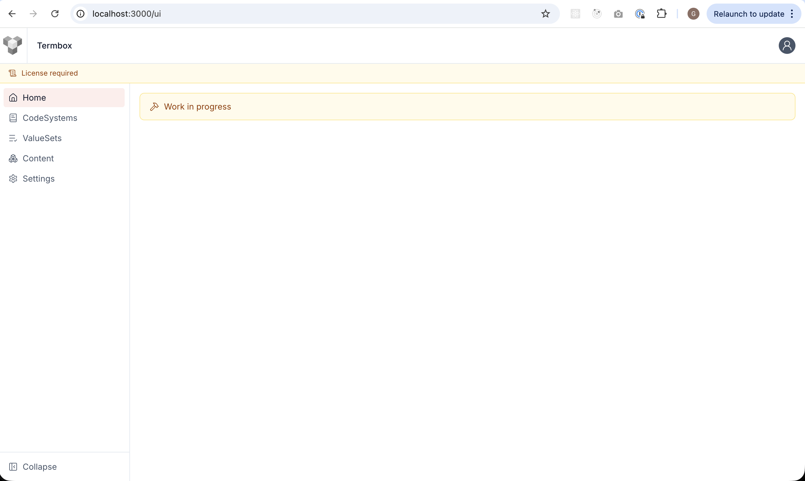
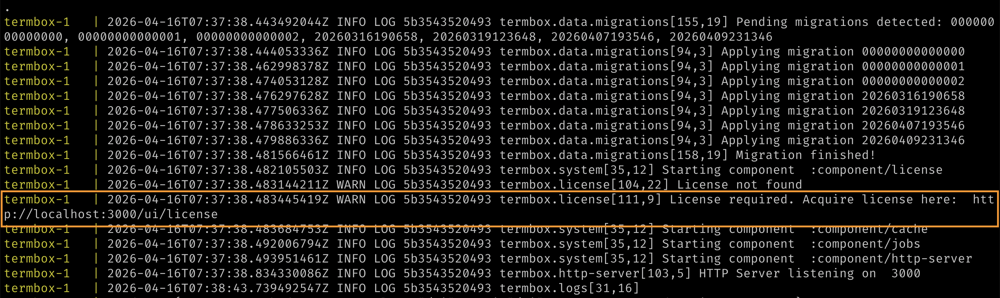
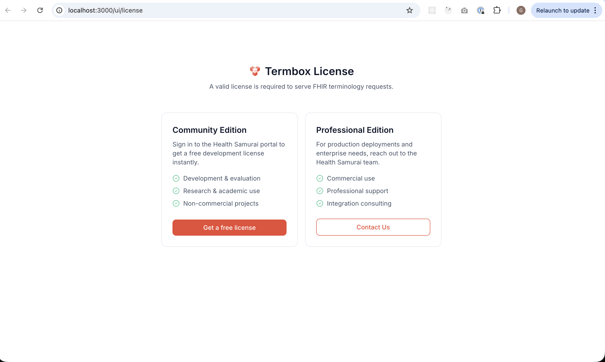
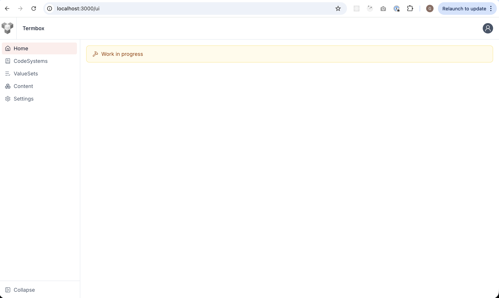
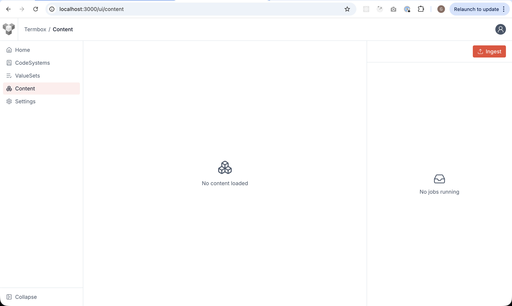
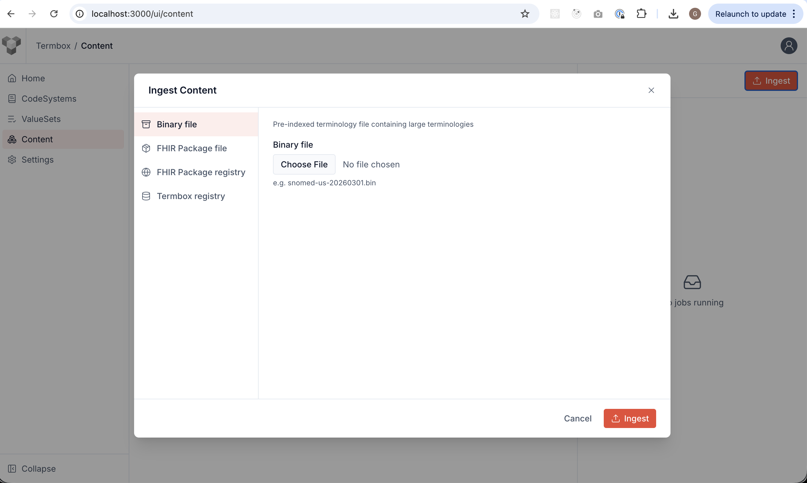

Running Termbox and getting a **Community** license.

[Docs > Getting Started > Quick Start](https://www.health-samurai.io/docs/termbox/getting-started#quick-start)

- [Running Termbox](#running-termbox)
- [Acquire a Community License](#acquire-a-community-license)

## Running Termbox

1. create [docker-compose.yaml](./docker-compose.yaml)
   ```yaml
    services:
    postgres:
        image: postgres:18
        environment:
        POSTGRES_USER: postgres
        POSTGRES_PASSWORD: postgres
        POSTGRES_DB: termbox
        volumes:
        - termbox_demo_001_postgres_data:/var/lib/postgresql
    termbox:
        depends_on:
        - postgres
        image: ghcr.io/healthsamurai/termbox:edge
        pull_policy: always
        ports:
        - "3000:3000"
        environment:
        PG_USER: postgres
        PG_PASSWORD: postgres
        PG_HOST: postgres
    volumes:
    termbox_demo_001_postgres_data: {}
   ```

2. run: `docker compose up`

3. open ui: http://localhost:3000/ui
   

4. Pay attention to the logs:
   
   ```log
   WARN LOG 5b3543520493 termbox.license[111,9] License required. Acquire license here:  http://localhost:3000/ui/license
   ```

## Acquire a Community License

1. Follow either of the two links, the one in the logs or the one in the yellow UI banner.

2. In the license view, click **Community Edition**
   

3. Sign in to Health Samurai portal and you will be redirected back to home without the yellow banner.
   

4. Go to **Content** page(/ui/content) using the left menu
   

5. Using the ingest button you have multiple options for loading content into Termbox
   
   Binary packages may be downloaded from: https://storage.cloud.google.com/termbox-public/snomed_int_20260201.bin

NEXT: [Content Demo](../002-loading-content/README.md)