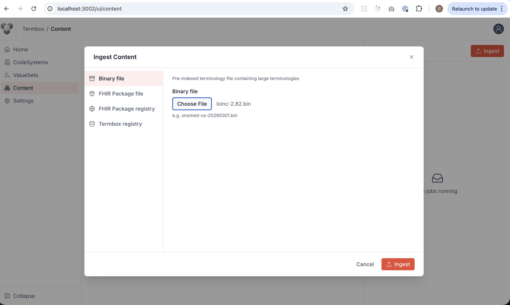
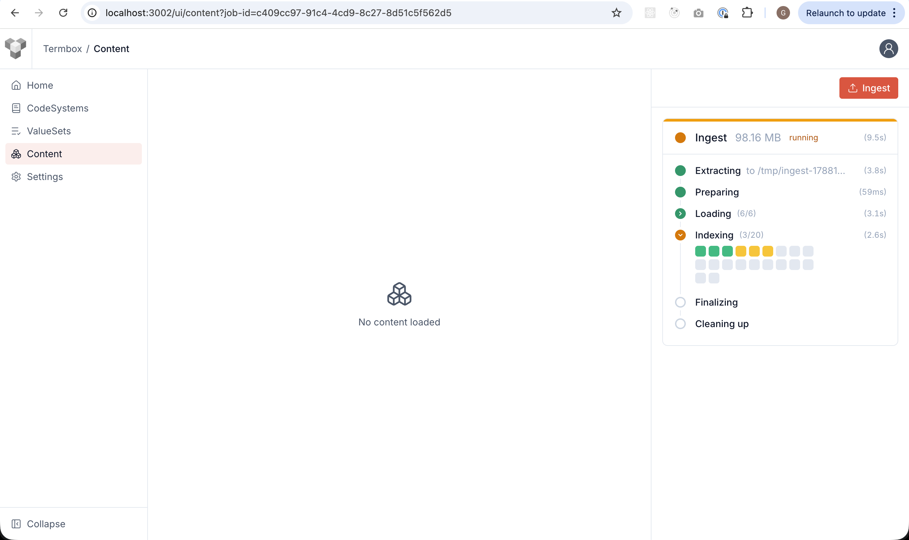
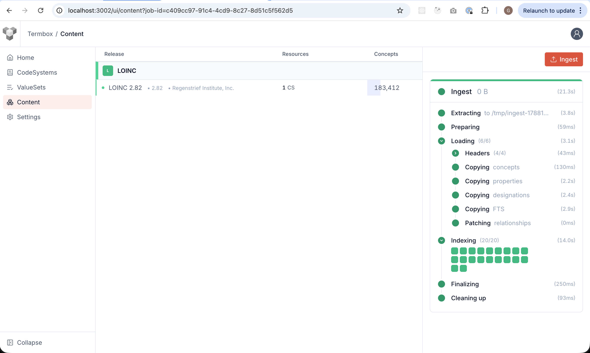
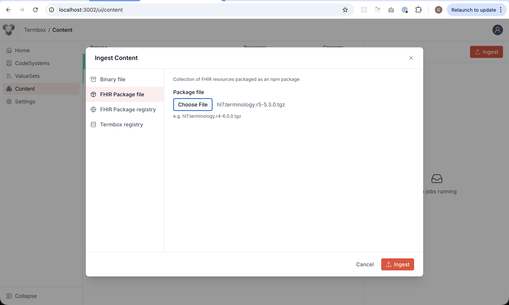
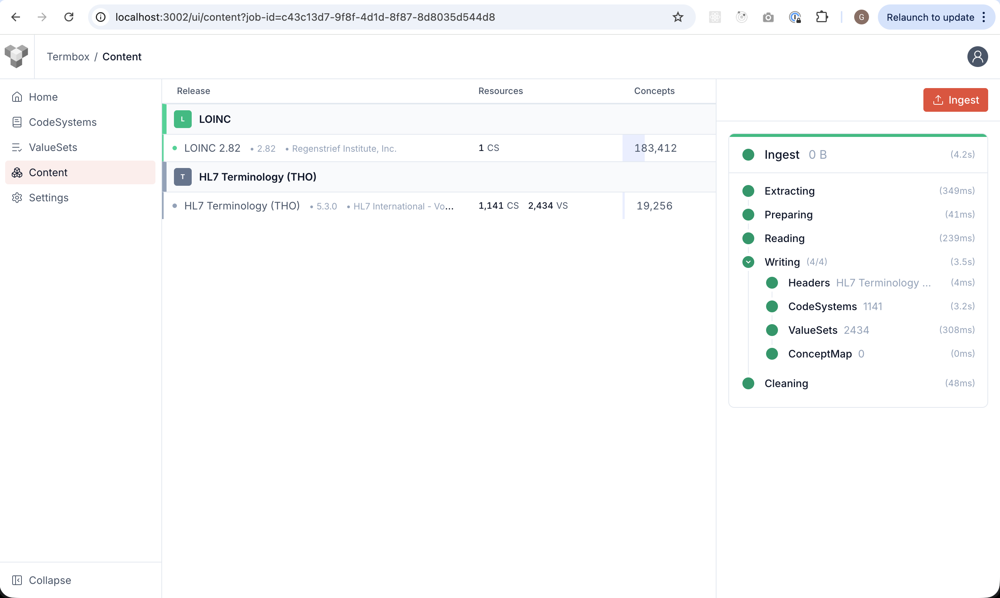
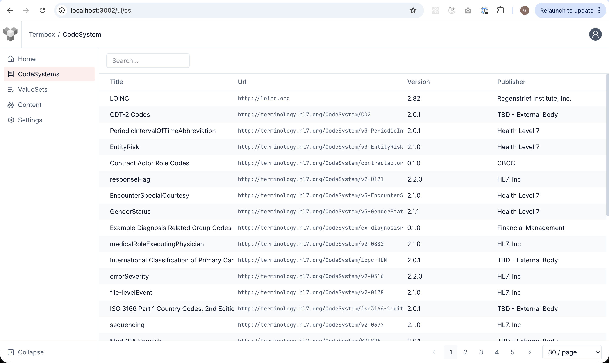
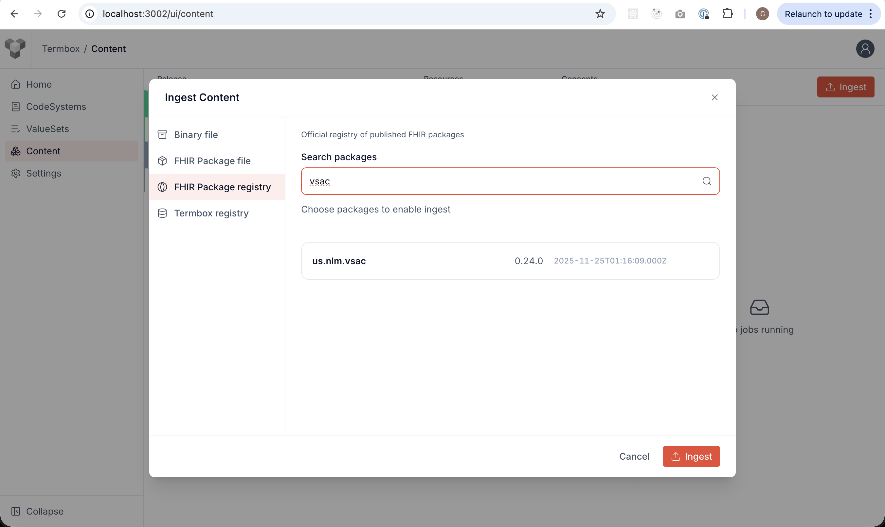
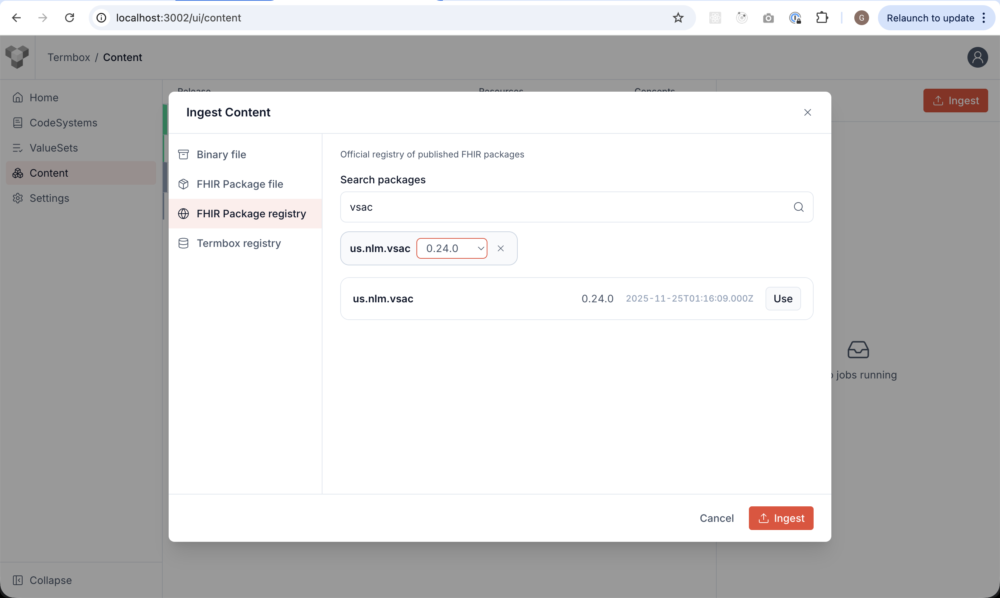
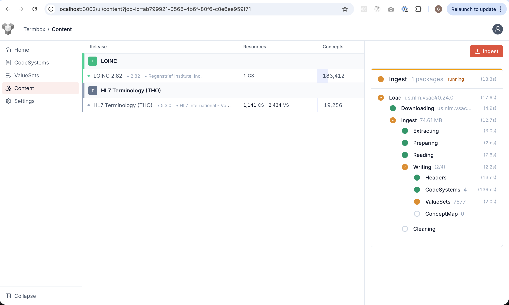
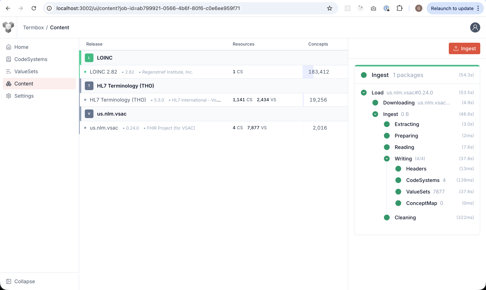

Loading content into Termbox using all of the supported sources:

- [Binary package](#binary-package)
- [FHIR Package File](#fhir-package-file)
- [FHIR Package Registry](#fhir-package-registry)
- [Ingestion API](#ingestion-api)
- [Config file (preload) \[wip\]](#config-file-preload-wip)
- [Termbox Registry (commint soon!)](#termbox-registry-commint-soon)

Preconditions:

- Termbox started
- License Acquired
- User in page: http://localhost:3002/ui/content and **Ingest** dialog open

## Binary package

1. Download Loinc binary package from https://storage.cloud.google.com/termbox-public/loinc-2.82.bin

2. In the **Ingest Content** modal, select **Binary File**, and **Chose** the loinc-2.82.bin you just downloaded.
   

3. Click **Ingest** and see the ingestion job progress in the right panel
   

4. When completed, the content page is updated
   

## FHIR Package File

1. Download a fhir package from any package registry, for example, using get-ig, lets download https://get-ig.org/hl7.terminology.r5/5.3.0: https://fs.get-ig.org/-/hl7.terminology.r5-5.3.0.tgz

2. In the **Ingest Content** modal, select **FHIR Package File**, and **Chose** the hl7.terminology.r5-5.3.0.tgz you just downloaded.
   

3. Click **Ingest** and see the ingestion job progress in the right panel

4. When completed, the content page is updated
   

5. Explore the loaded CodeSystems and ValueSets using the left menu
   

## FHIR Package Registry

1. In the **Ingest Content** modal, select **FHIR Package Registry**, and **Search** for: "vsac".
   

2. In the search results list, click **Use** in the package, and change the package version if needed
   

3. Click **Ingest** and see the ingestion job progress in the right panel
   

4. When completed, the content page is updated
   

## Ingestion API

1. Download RxNorm package from https://storage.cloud.google.com/termbox-public/rxnorm-full-03022026.bin

2. Load the file you just downloaded into termbox
   ```sh
   curl -X POST http://localhost:3002/admin/ingest -F "type=bin" -F "file=@/Users/guille/Downloads/rxnorm-full-03022026.bin"
   ```

3. Consult the status using the status url from the response
   ```sh
   curl "http://localhost:3002/admin/ingest/d2e98ff3-3ef1-45d1-bfdd-f96a201ae2d1/status"
   ```

## Config file (preload) [wip]

```yaml
# Example
sources:
  - id: snomed-int
    type: bin
    location: https://storage.googleapis.com/termbox-public/snomed_int_20260201.bin
  - id: rxnorm
    type: bin
    location: https://storage.googleapis.com/termbox-public/rxnorm-full-03022026.bin
  - type: npm
    package: hl7.fhir.r4.core
    version: 4.0.1
  - type: npm
    package: hl7.fhir.us.core
    version: 8.0.*
  - type: npm
    package: hl7.terminology
  - type: resource
    location: file:///opt/tx/resources/cs1.json
  - type: package
    location: file:///opt/tx/pkg.tgz
  - type: bundle
    location: file:///opt/tx/resources/bundle.json
  - type: bundle
    location: https://storage.googleapis.com/termbox-public/bundle.json
  - type: atom
    location: http://ontoserver-rw.termbox.svc/synd/syndication.xml
  - type: atom
    location: http://nhs.net/synd/syndication.xml
    auth:
      strategy: bearer
      secretRef: nhs-token
  - type: termbox # termbox marketplace
    url: http://snomed.info/sct

```

## Termbox Registry (commint soon!)

NEXT: [Loading SNOMED](../003-loading-snomed/README.md)