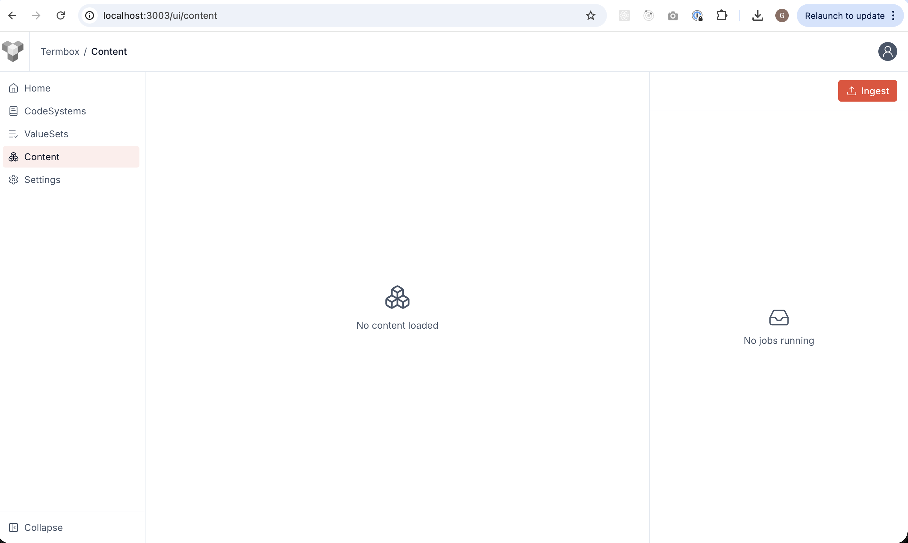
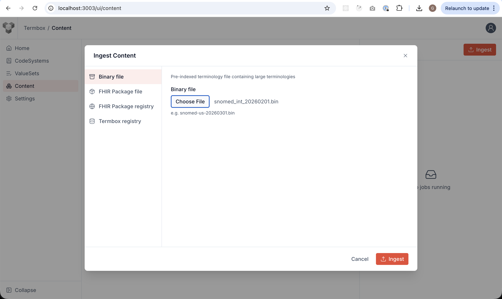
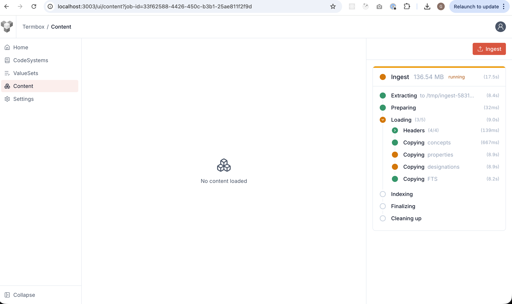
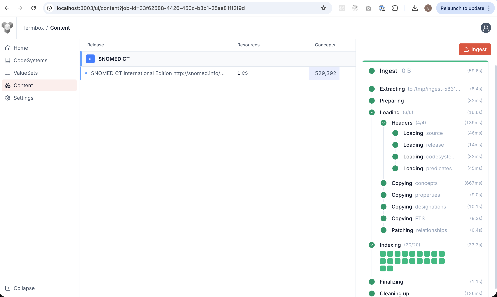
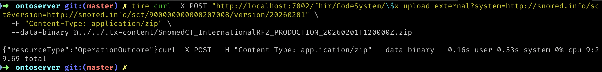

Loading SNOMED CT.

- [Load SNOMED INT Binary](#load-snomed-int-binary)
- [Compare with Ontoserver](#compare-with-ontoserver)
  - [Termbox Large Terminologies load time (Apple M3, 8 cores, 20GB RAM)](#termbox-large-terminologies-load-time-apple-m3-8-cores-20gb-ram)
- [The Gallery (coming soon!)](#the-gallery-coming-soon)

## Load SNOMED INT Binary

1. Download snomed package from: https://storage.cloud.google.com/termbox-public/snomed_int_20260201.bin

2. Go to the **Content** page(/ui/content) from the left menu
   

3. Open **Ingest Content** modal, select **Binary File** and **Chose** the file you just downloaded
   

4. Click ingest and see ingestion progress in the right panel
   

5. Remark: the whole process completes in less than 1 second
   

## Compare with Ontoserver

Besides Ontoserver takes a lot of time to start and to be ready, the ingestion of snomed itself takes a lot more than Termbox:

```sh
time curl -X POST "http://localhost:7002/fhir/CodeSystem/\$x-upload-external?system=http://snomed.info/sct&version=http://snomed.info/sct/900000000000207008/version/20260201" \
  -H "Content-Type: application/zip" \
  --data-binary @../../.tx-content/SnomedCT_InternationalRF2_PRODUCTION_20260201T120000Z.zip

# 0.16s user 0.53s system 0% cpu 9:29.69 total
```
Waited 9.5 minutes



### Termbox Large Terminologies load time (Apple M3, 8 cores, 20GB RAM)

| terminology | time  |
| ----------- | ----- |
| RxNorm      | 10sec |
| Loinc       | 18sec |
| SNOMED US   | 35sec |
| SNOMED UK   | 2min  |
| SNOMED INT  | 1min  |

## The Gallery (coming soon!)


NEXT: [TX Operations Demo](../004-tx-operations/README.md)