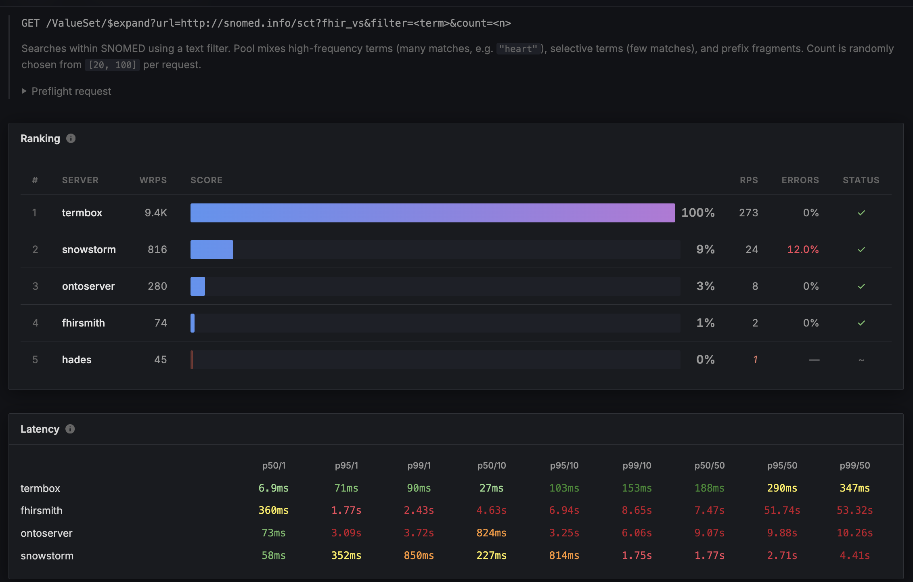
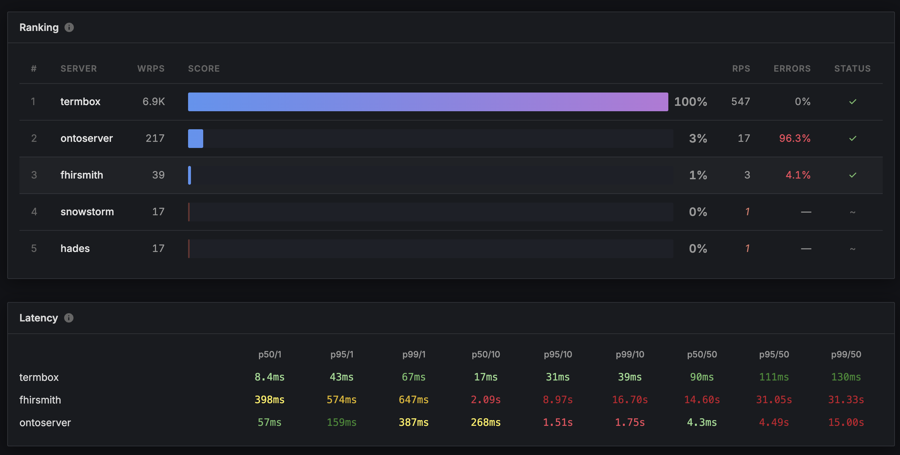
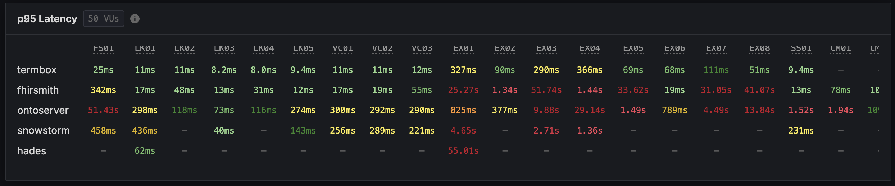

Dificult query scenarios and Termbox performance.

[FHIR TX Benchmark](https://healthsamurai.github.io/tx-benchmark/)

- [ValueSet/$expand + text-search](#valuesetexpand--text-search)
- [TX Benchmark](#tx-benchmark)

Preconditions:
- snomed int loaded

## ValueSet/$expand + text-search

1. Search for `diab` text under SNOMED INT clinical findings (404684003). Considering only active concepts with module id: 900000000000207008 (International)

```http
@base = http://localhost:3004/fhir
# @base = https://tx.health-samurai.io/fhir
# @base = http://tx.fhir.org/r4

POST {{base}}/ValueSet/$expand
Content-Type: application/json

{
  "resourceType": "Parameters",
  "parameter": [
    {
      "name": "valueSet",
      "resource": {
        "resourceType": "ValueSet",
        "compose": {
          "include": [
            {
              "system": "http://snomed.info/sct",
              "filter": [{
                "property": "concept",
                "op": "is-a",
                "value": "404684003"
              },{
                "property": "moduleId",
                "op": "=",
                "value": "900000000000207008"
              }]
            }
          ]
        }
      }
    },
    {
        "name": "activeOnly",
        "valueBoolean": true
    },
    {
        "name": "filter",
        "valueString": "diab"
    },
    {
      "name": "count",
      "valueInteger": 5
    }
  ]
}
```

## TX Benchmark

1. EX03 - Snomed text filter: https://healthsamurai.github.io/tx-benchmark/results/round-0/tests/EX03/
   

2. EX07 - Expand valueset composed of 3 codesystems (snomed, loinc, rxnorm) with a free text filter.
   

3. p95 at 50VUs
   